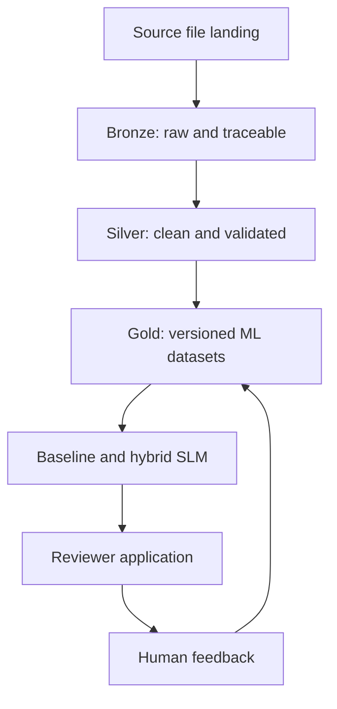
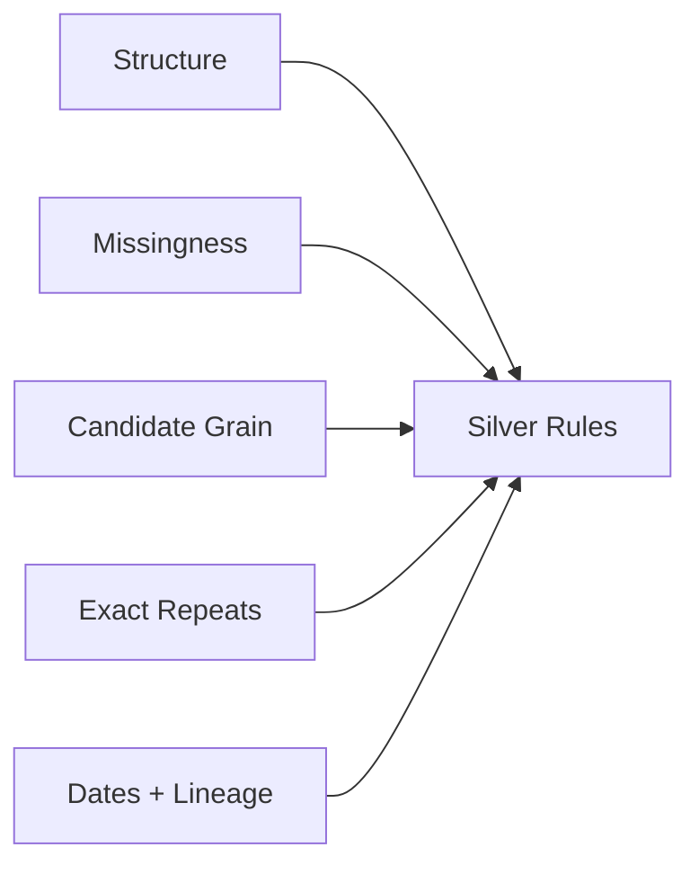
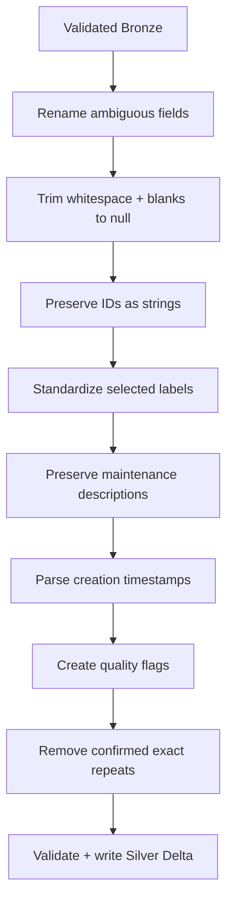

# Work Order Data Flywheel

[](https://github.com/terziceh/workorder-flywheel/actions/workflows/ci.yml)

**Project board:** [Work Order Data Flywheel](https://github.com/users/terziceh/projects/7)

An end-to-end build log and tutorial for developing a Databricks lakehouse, work-code recommendation model, and human-review data flywheel.

> [!IMPORTANT]
> The system may be developed and validated privately with authorized operational data. No source dataset is published. Every record, identifier, taxonomy example, screenshot preview, and reproducible result committed to this public repository must be synthetic, fictionalized, sanitized, or safely generalized.

## What this repository demonstrates

This repository follows the actual engineering dependency chain:

1. Define the business problem and privacy boundary.
2. Manage the work through GitHub Projects and implementation issues.
3. Land the source file in a governed Databricks Unity Catalog volume.
4. Build a traceable Bronze Delta ingestion notebook.
5. Profile and validate Bronze before downstream use.
6. Clean, standardize, and quality-check records in Silver.
7. Build versioned Gold training, inference, and evaluation datasets.
8. Analyze historical labels and define a defensible modeling strategy.
9. Train and evaluate a TF-IDF recommendation baseline.
10. Build and validate a hybrid SLM recommendation model.
11. Connect the approved model to a reviewer application and feedback flywheel.
12. Add application deployment automation only after the model and app are stable.

## Business problem

Facilities organizations produce large volumes of text-heavy work orders. Historical work codes can be missing, inconsistent, or incorrect, weakening operational reporting, asset analysis, and future model training. Manual review is slow, while fully automated classification can be unsafe when labels overlap or descriptions are ambiguous.

The proposed solution provides ranked work-code recommendations while keeping a human reviewer in control. Reviewer actions are preserved as evaluation evidence and potential retraining data.

## Target architecture



## Medallion responsibilities

| Layer | Main question | Responsibility |
|---|---|---|
| **Bronze** | What did the source contain? | Preserve raw history and lineage |
| **Silver** | Can we trust and consistently use the business fields? | Clean, standardize, validate, and handle confirmed data-quality problems |
| **Gold** | What does a specific analytical/modeling use case need? | Build model text, features, context, labels, and versioned datasets |

## Current implementation plan

| Issue | Deliverable | Status |
|---:|---|---|
| [#2](https://github.com/terziceh/workorder-flywheel/issues/2) | Load source data into Databricks | ✅ Complete |
| [#3](https://github.com/terziceh/workorder-flywheel/issues/3) | Build Bronze tables and ingestion notebook | ✅ Complete |
| [#4](https://github.com/terziceh/workorder-flywheel/issues/4) | Profile and validate Bronze | ✅ Complete |
| [#5](https://github.com/terziceh/workorder-flywheel/issues/5) | Build the Silver pipeline | ✅ Complete |
| [#6](https://github.com/terziceh/workorder-flywheel/issues/6) | Build Gold ML datasets | 🟡 Next |
| [#7](https://github.com/terziceh/workorder-flywheel/issues/7) | Analyze labels and modeling strategy | ⏳ Planned |
| [#8](https://github.com/terziceh/workorder-flywheel/issues/8) | Train the TF-IDF baseline | ⏳ Planned |
| [#9](https://github.com/terziceh/workorder-flywheel/issues/9) | Build the hybrid SLM model | ⏳ Planned |

## Tutorial chapters

| Chapter | Purpose |
|---|---|
| [Business problem](docs/00_business_problem.md) | Users, risks, scope, and success metrics |
| [GitHub project setup](docs/01_github_project_setup.md) | Board, issues, branches, pull requests, and current CI |
| [Databricks and source setup](docs/02_environment_setup.md) | Governed file landing and safe screenshot walkthrough |
| [Public synthetic companion data](docs/03_synthetic_data.md) | Reproducible examples without distributing the source dataset |
| [Bronze ingestion](docs/04_bronze_ingestion.md) | Full-refresh notebook, Delta table, basic lineage, and count reconciliation |
| [Bronze validation](docs/04_bronze_ingestion.md#bronze-validation-and-profiling) | Checks performed, generalized findings, duplicate review, and Silver decisions |
| [Silver transformations](docs/05_silver_transformations.md) | Implemented cleaning, standardization, quality flags, and duplicate handling |
| [Gold data products](docs/06_gold_data_products.md) | Versioned ML datasets and leakage-resistant splits |
| [Baseline model](docs/07_baseline_model.md) | Label analysis and TF-IDF benchmark |
| [SLM recommendation engine](docs/08_slm_recommendation_engine.md) | Constrained hybrid recommendations and evaluation |
| [Feedback flywheel](docs/09_feedback_flywheel.md) | Governed reviewer actions and future learning data |
| [Reviewer application](docs/10_reviewer_application.md) | Accept, correct, flag, and abstain workflow |
| [CI/CD and deployment](docs/11_ci_cd_and_deployment.md) | Release workflow after model and application stability |
| [Results and lessons](docs/12_results_and_lessons.md) | Metrics, problems, fixes, limitations, and next steps |

## Current status

**Current stage:** Bronze and Silver are implemented. The next dependency is Gold dataset design and model-specific feature preparation under [#6](https://github.com/terziceh/workorder-flywheel/issues/6).

- [x] Repository foundation and public Project board
- [x] Privacy boundary
- [x] Documentation and issue structure
- [x] Repository CI
- [x] Complete the sanitized Databricks source-landing walkthrough
- [x] Build and validate the Bronze ingestion notebook
- [x] Profile Bronze structure, missing values, candidate grain, and exact repeats
- [x] Inspect creation-date samples and check ingestion metadata
- [x] Build the first Silver cleaning transformations
- [x] Standardize descriptive field names and business labels
- [x] Preserve maintenance descriptions for downstream modeling
- [x] Parse creation timestamps and create quality flags
- [x] Remove confirmed exact duplicate exports while preserving legitimate multi-phase work orders
- [x] Write and validate the Silver Delta table
- [ ] Profile Silver for Gold dataset design
- [ ] Build Gold analytical and model-ready datasets
- [ ] Continue through modeling and the feedback flywheel

### Bronze ingestion implemented

The reviewed private notebook reads a landed CSV with source columns kept as strings, standardizes column names with a collision check, adds `_ingested_at` and `_source_file`, and overwrites the Bronze Delta snapshot. Its saved output confirms that the readable source and persisted Bronze row counts matched.

This version uses configuration variables and a manually supplied source filename, not notebook widgets or incremental batch controls. Overwrite is the documented full-refresh strategy; count reconciliation verifies row totals, not field-level parsing, uniqueness, or business correctness.

See the [Bronze walkthrough](docs/04_bronze_ingestion.md) for code, explanations, and limitations. The original notebook and operational outputs remain private.

### Bronze validation completed

Bronze validation reviewed structure, missing values, candidate grain, exact repeated records, creation-date examples, and ingestion lineage without rewriting the Bronze table. Repeated work-order numbers were not treated as duplicates because one work order can legitimately contain multiple phases.



The duplicate review isolated exact repeated business records for separate confirmation and informed the Silver cleaning rules. Operational records and review exports remain private.

### Silver cleaning implemented

Bronze profiling was used to define the first Silver transformation rules. The Silver pipeline now standardizes business-facing field names, normalizes blanks and whitespace, preserves identifiers as text, standardizes selected categorical labels, parses creation timestamps, and adds explicit data-quality flags.



Maintenance descriptions are intentionally preserved rather than aggressively cleaned because their terminology and structure may be useful to downstream work-code and asset modeling. Model-specific `model_text`, keyword extraction, TF-IDF preparation, embeddings, and feature engineering are deferred to Gold.

The exact repeated export records identified during Bronze validation were reviewed before removal. Silver retains one copy of each complete business record while preserving legitimate multi-phase work orders, then writes the cleaned snapshot as a Delta table and validates the saved result.

Read the [Silver transformation walkthrough](docs/05_silver_transformations.md) for the implementation decisions, validation approach, and current limitations.

## Repository organization

```text
.
├── .github/             Issue templates, PR template, and current CI
├── configs/             Non-sensitive configuration
├── docs/                Build tutorial and engineering decisions
├── notebooks/           Exploration and communication only
├── sample_data/         Small generated examples only
├── scripts/             Developer entry points
├── src/workorder_ai/    Reusable pipeline and model code
├── tests/               Unit, integration, data, and model tests
├── CONTRIBUTING.md
├── Makefile
├── pyproject.toml
└── README.md
```

## Evidence standard

Every technical stage should include:

- Objective, input, output, and table grain
- Implementation or notebook walkthrough
- Validation and reconciliation
- Problems, root causes, fixes, and tradeoffs
- Tests and reproducibility instructions
- Sanitized screenshots or synthetic output
- Related issue, commit, or pull request
- Known limitations and next dependency

## Privacy and screenshot rules

Public screenshots must not expose real records, employer or employee identifiers, email addresses, workspace URLs, credentials, internal storage paths, or unauthorized operational metrics. Screenshots are reviewed and cropped or redacted before publication. Example rows and public model demonstrations use synthetic data.

See [Security and Privacy](docs/security_and_privacy.md).

## GitHub Actions scope

Current CI checks the public Python package, tests, and synthetic-data generation. Data and model checks will be added when their implementation reaches the repository. Application build and deployment workflows remain intentionally deferred until the reviewer application exists.

## License

Released under the [MIT License](LICENSE).
